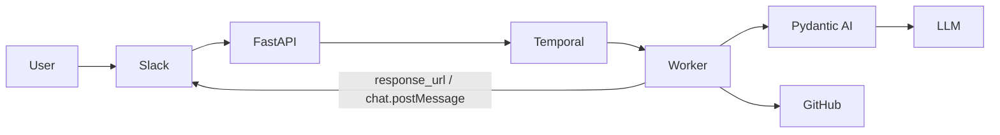

# Coding Agent Platform

A Slack-native, enterprise-ready coding assistant.
Pydantic AI does the thinking, Temporal does the orchestration, FastAPI is
the front door, and AWS EKS (provisioned with Terraform, deployed with Helm)
is the home.

> The emphasis is on **clarity, security,
> and reproducibility** — not feature breadth.


Full diagrams: [docs/architecture.md](docs/architecture.md). Design rationale:
[DESIGN.md](DESIGN.md). Threat model: [SECURITY.md](SECURITY.md).

---

## Repository layout

```
coding-agent-platform/
├── packages/coding_agent/         # shared library (config, models, agent, slack, github)
├── services/
│   ├── api/                       # FastAPI Slack endpoint + healthz/metrics
│   └── worker/                    # Temporal worker + workflow + activities
├── deploy/helm/coding-agent/      # Helm chart (api + worker)
├── infra/terraform/               # VPC + EKS + ECR + Secrets Manager + IRSA
├── docker-compose.yml             # local dev: Temporal + API + worker
├── docs/architecture.md           # Mermaid diagrams
├── DESIGN.md                      # design notes
├── SECURITY.md                    # threat model & controls
└── Makefile                       # all the everyday commands
```

---

## 1. Local development

### Prerequisites
- Python 3.11+ (only needed for `make test`/`run-*`)
- Docker + Docker Compose (for the full stack)
- A free [Groq API key](https://console.groq.com)
- A Slack app with a slash command (see “Slack app setup” below)

### Setup
```bash
git clone <repo-url> coding-agent-platform
cd coding-agent-platform
cp .env.example .env
# Edit .env: at minimum SLACK_SIGNING_SECRET, SLACK_BOT_TOKEN, GROQ_API_KEY
```

### Run the full stack
```bash
make compose-up       # Temporal + API + 2 workers
open http://localhost:8080  # Temporal Web UI
```

Expose the API to Slack with any HTTPS tunnel:
```bash
ngrok http 8000
# Set Slack slash command Request URL to:
# https://<your-tunnel>.ngrok.app/slack/events
```

### Run the tests
```bash
make install
make test            # pytest
make lint            # ruff
make typecheck       # mypy
```

---

## 2. Slack app setup
1. Create an app at https://api.slack.com/apps → **From scratch**.
2. **OAuth & Permissions** → add bot scopes: `chat:write`, `chat:write.public`,
   `commands`, `app_mentions:read`.
3. **Slash Commands** → add `/coding` with Request URL
   `https://<host>/slack/events`.
4. **Event Subscriptions** (optional, for `@mention` support) → enable, set the
   request URL to the same endpoint, subscribe to `app_mention`.
5. **Basic Information** → copy **Signing Secret** → set
   `SLACK_SIGNING_SECRET`.
6. Install the app to your workspace, copy the **Bot User OAuth Token** →
   `SLACK_BOT_TOKEN`.

The platform verifies the Slack signature on every request and refuses
unsigned ones; never disable that in production.

---

## 3. Deploy to AWS EKS

### 3.1 Provision infrastructure
```bash
cd infra/terraform
cp example.tfvars terraform.tfvars
# Edit terraform.tfvars with real values
terraform init
terraform apply
```
Terraform creates:
- VPC (3 AZs, NAT gateway, public/private subnets)
- EKS cluster (managed node group, IRSA enabled, core add-ons)
- ECR repositories `coding-agent/api` and `coding-agent/worker` (immutable, scan-on-push, AES-256)
- Secrets Manager secret with the Slack/LLM/GitHub credentials
- IAM role (IRSA) bound to `system:serviceaccount:coding-agent:coding-agent`
  with read access to the secret

Outputs include the kubeconfig command and the IAM role ARN.

### 3.2 Build & push images
```bash
aws ecr get-login-password --region $(terraform -chdir=infra/terraform output -raw aws_region 2>/dev/null || echo us-west-2) \
  | docker login --username AWS --password-stdin $(terraform -chdir=infra/terraform output -raw ecr_api_repo_url | cut -d/ -f1)

API_REPO=$(terraform -chdir=infra/terraform output -raw ecr_api_repo_url)
WORKER_REPO=$(terraform -chdir=infra/terraform output -raw ecr_worker_repo_url)
TAG=$(git rev-parse --short HEAD)

docker build -f services/api/Dockerfile    -t $API_REPO:$TAG    .
docker build -f services/worker/Dockerfile -t $WORKER_REPO:$TAG .
docker push $API_REPO:$TAG
docker push $WORKER_REPO:$TAG
```

### 3.3 Install Temporal in the cluster (one-time)

```bash
helm repo add temporal https://go.temporal.io/helm-charts
helm repo update
kubectl create namespace temporal

helm install temporal temporal/temporal --version 0.62.0 -n temporal \
  --set server.replicaCount=1 \
  --set cassandra.config.cluster_size=1 \
  --set prometheus.enabled=false \
  --set grafana.enabled=false \
  --set elasticsearch.enabled=false \
  --set admintools.image.tag=1.22.4 \
  --set schema.setup.image.tag=1.22.4 \
  --set schema.update.image.tag=1.22.4 \
  --set server.image.tag=1.22.4 \
  --timeout 20m \
  --wait
```

This installs Temporal with Cassandra backend, version-pinned for reproducibility,
with monitoring components disabled to reduce resource footprint.

### 3.4 Install the chart
```bash
$(terraform -chdir=infra/terraform output -raw kubeconfig_command)
kubectl create namespace coding-agent

helm upgrade --install coding-agent deploy/helm/coding-agent \
  --namespace coding-agent \
  --set image.repository=$API_REPO \
  --set image.tag=$TAG \
  --set serviceAccount.annotations."eks\.amazonaws\.com/role-arn"=$(terraform -chdir=infra/terraform output -raw app_iam_role_arn)
```
The chart deploys two `Deployment`s (`api`, `worker`), HPAs, PDBs, a
ClusterIP `Service`, an ALB `Ingress`, and a default-deny `NetworkPolicy`.
Secrets are read directly from AWS Secrets Manager using IRSA (no ESO needed).

### 3.5 Verify
```bash
kubectl -n coding-agent get pods,svc,ingress,hpa
kubectl -n coding-agent logs -l app.kubernetes.io/component=worker -f
```
Point your Slack slash command Request URL at the ALB hostname:
```
https://coding-agent.example.com/slack/events
```

---

## 4. Cleanup

```bash
helm uninstall coding-agent -n coding-agent
kubectl delete namespace coding-agent
helm uninstall temporal -n temporal
kubectl delete namespace temporal

cd infra/terraform && terraform destroy
```
This removes the EKS cluster, NAT gateway, ECR repos, Secrets Manager
secret, DynamoDB conversations table, and all IAM roles — i.e. everything
that costs money.

---

## 5. Configuration reference

| Variable               | Default                              | Purpose                             |
|------------------------|--------------------------------------|-------------------------------------|
| `SLACK_BOT_TOKEN`      | —                                    | Bot OAuth token (`xoxb-…`)          |
| `SLACK_SIGNING_SECRET` | —                                    | Used to verify request signatures   |
| `GROQ_API_KEY`         | —                                    | LLM provider credential             |
| `LLM_MODEL`            | `groq:llama-3.3-70b-versatile`       | Any Pydantic AI model string        |
| `TEMPORAL_HOST`        | `localhost:7233`                     | Temporal frontend gRPC endpoint     |
| `TEMPORAL_NAMESPACE`   | `default`                            |                                     |
| `TEMPORAL_TASK_QUEUE`  | `coding-task-queue`                  |                                     |
| `CONVERSATIONS_TABLE`  | `""`                                 | DynamoDB table for per-user memory  |
| `AWS_REGION`           | `us-east-1`                          | AWS region for DynamoDB access      |
| `HISTORY_MAX_TURNS`    | `20`                                 | Max conversation turns to retain    |
| `GITHUB_TOKEN`         | empty                                | If empty → mock GitHub client used  |
| `USE_GITHUB_MOCK`      | `true`                               | Force the mock implementation       |
| `GITHUB_DEFAULT_REPO`  | `octocat/Hello-World`                | Repo used when the user doesn't say |
| `LOG_LEVEL`            | `INFO`                               |                                     |
| `ENVIRONMENT`          | `local`                              | Tag included in logs                |

---

## 6. Testing the agent

Once everything is running:

```
/coding write a Python function that returns the nth Fibonacci number
/coding open an issue titled "Add type hints" with body "Please add typing throughout"
/coding list files in src
```

The mock GitHub client is enabled by default, so the issue is *not*
actually filed unless you set `USE_GITHUB_MOCK=false` and a real
`GITHUB_TOKEN`.

---

## 7. CI

`.github/workflows/ci.yml` runs on every push/PR:
- `ruff check` + `mypy` + `pytest --cov`
- Docker image builds (api + worker)
- `helm lint` + `helm template` (and `kubeval` for manifest sanity)
- `terraform fmt -check`, `terraform init -backend=false`, `terraform validate`

---

## 8. License
MIT — see [LICENSE](LICENSE).
