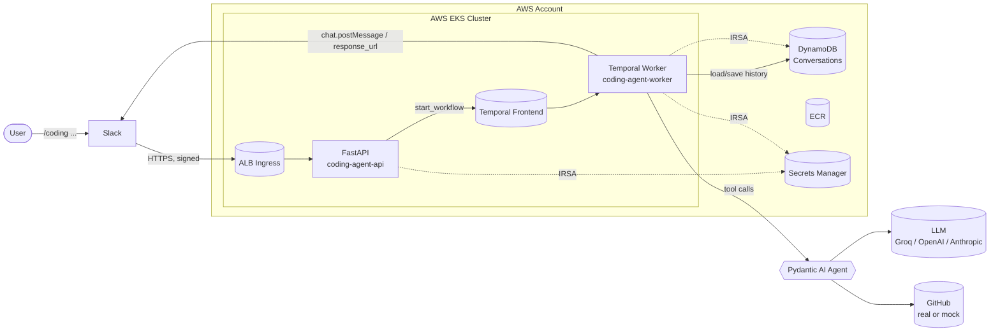
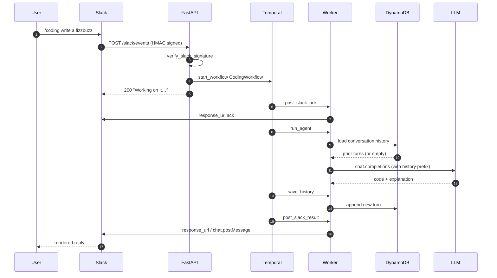

# Architecture

```mermaid
flowchart LR
    User([User]) -->|/coding ...| Slack
    Slack -- HTTPS, signed --> Ingress[(ALB Ingress)]
    Ingress --> API[FastAPI<br/>coding-agent-api]
    API -->|start_workflow| TF[(Temporal Frontend)]
    TF --> Worker[Temporal Worker<br/>coding-agent-worker]
    Worker -->|tool calls| Agent{{Pydantic AI Agent}}
    Agent --> LLM[(LLM<br/>Groq / OpenAI / Anthropic)]
    Agent --> GH[(GitHub<br/>real or mock)]
    Worker -->|chat.postMessage / response_url| Slack
    Worker -->|load/save history| DDB[(DynamoDB<br/>Conversations)]
    subgraph EKS["AWS EKS Cluster"]
      Ingress
      API
      Worker
      TF
    end
    subgraph AWS["AWS Account"]
      EKS
      ECR[(ECR)]
      SM[(Secrets Manager)]
      DDB
    end
    API -. IRSA .-> SM
    Worker -. IRSA .-> SM
    Worker -. IRSA .-> DDB
```

## Request lifecycle

```mermaid
sequenceDiagram
    autonumber
    participant U as User
    participant S as Slack
    participant A as FastAPI
    participant T as Temporal
    participant W as Worker
    participant D as DynamoDB
    participant L as LLM
    U->>S: /coding write a fizzbuzz
    S->>A: POST /slack/events (HMAC signed)
    A->>A: verify_slack_signature
    A->>T: start_workflow CodingWorkflow
    A-->>S: 200 "Working on it…"
    T->>W: post_slack_ack
    W->>S: response_url ack
    T->>W: run_agent
    W->>D: load conversation history
    D-->>W: prior turns (or empty)
    W->>L: chat.completions (with history prefix)
    L-->>W: code + explanation
    T->>W: save_history
    W->>D: append new turn
    T->>W: post_slack_result
    W->>S: response_url / chat.postMessage
    S-->>U: rendered reply
```
